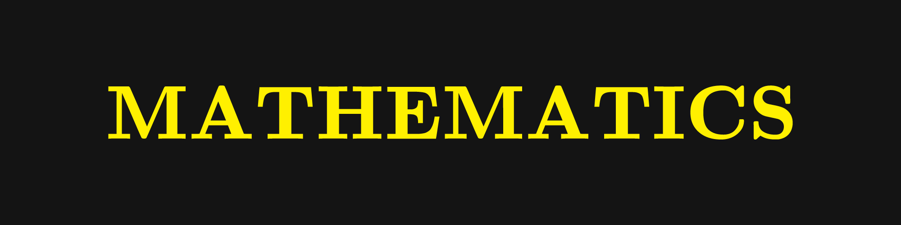
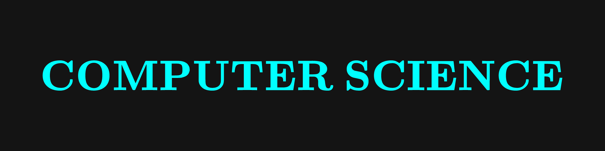

This is a combined list of all resources (books, lecture notes, lectures, summaries. etc.) in all the topics in mathematics, physics, and computer science. The edition of the books are not included as it is assumed that the latest edition would be the one being referred to. 

# Identification
**(U)** - Undergraduate
**(G)** - Graduate
**(B)** - Textbook
**(L)** - Online Lectures

# Mathematics (MATH)
## Abstract Algebra
- **Abstract Algebra** by *Israel Nathan Herstein*
- **Algebra** by *Serge Lang*
- **Galois Theory** by *Ian Stewart*
- **Abstract Algebra** by *David Steven Dummit, Richard M. Foote*
- **Introduction to Modern Algebra** by *Marvin Marcus*

## Algebraic Geometry
- **Basic Algebraic Geometry** by *Igor Shafarevich*

## Algebraic Number Theory
- 

## Algebraic Topology
- **Basic Concepts of Algebraic Topology** by *Fred H. Croom*
- **Algebraic Topology: An Intuitive Approach** by *Hajime Sato*
- **Algebraic Topology** by *Allen Hatcher*
- **Topology and Geometry** by *Glen Bredon*
- **Algebraic Topology** by *Tammo tom Dieck*
- **Differential Forms in Algebraic Topology** by *Loring W. Tu, Raoul Bott*
- **Algebraic Topology** by *Edwin Spanier*
- **Algebraic Topology** by *Allen Hatcher*
- **Differential Forms in Algebraic Topology** by *Loring W. Tu, Raoul Bott*
- **Characteristic Classes** by *John Milnor, James Stasheff*

## Analytic Number Theory
- **Introduction to Analytic Number Theory** by *Tom M. Apostol*

## Category Theory
- 

## Class Field Theory
- 

## Commutative Algebra
- 

## Complex Analysis
- **Complex Variables and Applications** by *James Ward Brown, Ruel Vance Churchill*
- **Basic Complex Analysis** by *Jerrold E. Marsden, Michael J. Hoffman*
- **Complex Analysis: An Introduction to the Theory of Analytic Functions of One Complex Variable** by *Lars Ahlfors*

## Differential Equations
- **Differential Dynamical Systems** by *J.D. Meiss*
- **Applied Partial Differential Equations** by *Peter Markowich*
- **Ordinary Differential Equations** by *Richard K. Miller, Anthony N. Michel*

## Differential Geometry
- **A Comprehensive Introduction to Differential Geometry** by *Michael Spivak*
- **Riemannian Geometry** by by *Manfredo Perdigao do Carmo*
- **Introduction to Topological Manifolds** by *John M. Lee*
- **Introduction to Smooth Manifolds** by *John M. Lee*
- **Introduction to Riemannian Manifolds** by *John M. Lee*
- **Differential Manifolds** by *Antoni A. Kosinski*
- **Classical Differential Geometry** by *Peter Petersen*
- **From Calculus to Cohomology: De Rham Cohomology and Characteristic Classes** by *Ib Madsen, Jxrgen Tornehave*
- **Foundations of Differential Geometry** by *Katsumi Nomizu, Shoshichi Kobayashi*

### Classical
- **Differential Geometry of Curves and Surfaces** by *Victor Andreevich Toponogov*
- **Differential Geometry: Curves - Surfaces - Manifolds** by *Wolfgang Kuhnel*
- **Differential Geometry** by *Erwin Kreyszig*
- **Lectures on Classical Differential Geometry** by *Dirk Jan Struik*

### Modern
- **Manifolds and Differential Geometry** by *Jeffrey M. Lee*
- **Geometry of Manifolds** by *Liviu Nicolaescu* 
- **Riemannian Geometry and Geometric Analysis** by *Jürgen Jost*
- **Riemannian Geometry** by *Peter Petersen*
- **Lectures on Symplectic Geometry** by *Cannas da Silva*
- **An Introduction to Symplectic Geometry** by *Rolf Berndt*

## Differential Topology
- **Differential Topology** by *Alan Pollack, Victor Guillemin*
- **Introduction to Differential Topology** by *Klaus Jänich, T. Bröcker*
- **Differential Topology** by *Morris Hirsch*
- **Topology from the Differentiable Viewpoint** by *John Milnor*

## Functional Analysis
- 

## General Topology
- **A First Course in Topology** by *James Munkres*
- **Topology** by *Klaus Jänich*
- **A Taste of Topology** by *Volker Runde*

## Graph Theory
- 

## Lie Algebra
- **An Introduction to Lie Groups and Lie Algebras** by *Alexander Kirillov*
- **Differential Geometry - Lie Groups and Symmetric Spaces** by *Sigurður Helgason*

## Linear Algebra
- **Introduction to Linear Algebra** by *Gilbert Strang*
- **Linear Algebra** by *Serge Lang*
- **Linear Algebra** Done Right by *Sheldon Axler*
- **Linear Algebra** by *Kenneth Hoffman, Ray Kunze*

## Logic and Set Theory
- **Elements of Set Theory** by *Herbert B. Enderton*
- **A Mathematical Introduction to Logic** by *Herbert B. Enderton*
- **A Course in Mathematical Logic for Mathematicians** by *Koblitz*

## Mathematical Biology
- 

## Measure Theory
- **A Radical Approach to Lebesgue's Theory of Integration** by *David M. Bressoud*
- **Introduction to Measure Theory** by *Terence Tao*

## Number Theory
- 

## Optimization
- **Combinatorial Optimization** by *Bernhardt Korte, Jens Vygen*

## Probability Theory
- **Introduction to Probability** by *Jessica Hwang, Joseph K. Blitzstein*
- **An Introduction to Probability Theory** by *P. A. P. Moran*

## Real Analysis
- 

## Statistics
- 

## Stochastic Processes
- 

## Vector Calculus
- 

## Miscellaneous
- **Fourier Analysis** by *T. W. Körner*
- **Transformation Geometry: An Introduction to Symmetry** by *George Edward Martin*
- **A Philosophy to Mathematics** by *Louis Kattsoff*
- **How Mathematicians Think** by *William Byers*
- **[The Coq Proof Assistant](https://coq.inria.fr/)**
- **[Isabelle Proof Assistant](https://isabelle.in.tum.de/)**
- **[Agda Proof Assistant](https://wiki.portal.chalmers.se/agda/Main/HomePage)**
- 

# Physics (PHYS)

## Astroparticle Physics
- 

## Atomic, Molecular, and Optical Physics
- 

## Biophysics
- 

## Classical Mechanics
- **Classical Mechanics** by *John R. Taylor*
- **Classical Mechanics** by *Herbert Goldstein*
- **Mathematical Methods of Classical Mechanics** by *Vladimir Arnold*
- **Course of Theoretical Physics, Volume 1: Mechanics** by *Lev Landau, Evgeny Lifshitz*

## Computational Physics
- 

## Condensed Matter Physics
- 

## Cosmology

## Electromagnetism
- **Introduction to Electrodynamics** by *David J. Griffiths*
- **Classical Electrodynamics** by *John David Jackson*
- **Course of Theoretical Physics, Volume 2: The Classical Theory of Fields** by *Lev Landau, Evgeny Lifshitz*
- **Course of Theoretical Physics, Volume 8: Electrodynamics of Continuous Media** by *Lev Landau, Evgeny Lifshitz*, Lev Pitaevskii

## General Relativity
- **Gravity** by *James Hartle*
- **A First Course in General Relativity** by *Bernard Schutz*
- **Spacetime and Geometry: An Introduction to General Relativity** by *Sean Carroll*

## High Energy Astrophysics
- **High Energy Astrophysics** by *Malcolm S. Longair*
- **High-Energy Astrophysics** by *Fulvio Melia*
- **Foundations of High-Energy Astrophysics** by *Mario Vietri*

## Large Scale Structure
- 

## Mathematical Methods for Physics
- **Mathematical Methods for Physicists** by *George B. Arfken, Hans J. Weber, Frank E. Harris*
- **Mathematical Methods for Physics and Engineering: A Comprehensive Guide** by *K. F Riley, Michael Hobson, Stephen John Bence*
- **Mathematical Methods in the Physical Sciences** by *Mary L. Boas*
- **A Course in Modern Mathematical Physics: Groups, Hilbert Space and Differential Geometry** by *Peter Szekeres*
- **Foundations of Mathematical Physics** by *Sadri Hassani*

## Mathematical Physics
- **Geometry, Topology, and Physics** by *Mikio Nakahara*
- **The Geometry of Physics** by *Theodore Frankel*

## Nuclear Physics
- 

## Observational Astronomy
- 

## Particle Physics
- 

## Plasma Physics
- 

## Quantum Computing
- **Quantum Computation and Quantum Information** by *Isaac Chuang, Michael Nielsen*
- **Classical and Quantum Computation** by *Alexander Shen, Alexei Kitaev, and Mikhail N. Vyalyi*
- **Quantum Computation and Quantum Information Simulation Using Python: A Gentle Introduction** by *Shinil Cho*
- **Quantum Computer Science** by *N. David Mermin*
- **Quantum Computing for Computer Scientists** by *Mirco A. Mannucci, Noson S. Yanofsky*
- **Quantum Computing: A Gentle Introduction** by *Eleanor Rieffel, Wolfgang Polak*
- **[Azure Quantum](https://quantum.microsoft.com/)** and **[Azure Quantum Documentation](https://learn.microsoft.com/en-us/azure/quantum/)** by *Microsoft*
- **[IBM Quantum Platfrom](https://quantum.ibm.com/)** and **[IBM Quantum Documentation](https://docs.quantum.ibm.com/)** and **[IBM Quantum Learning](https://learning.quantum.ibm.com/)** by *IBM*

## Quantum Field Theory
- **An Introduction to Quantum Field Theory** by *M. Peskin*, *D. Schroeder*
- **Lectures on Quantum Field Theory** by *Ashok Das*
- **Quantum Field Theory** by *Lewis Ryder*
- **Quantum Field Theory** by *Claude Itzykson*, *Jearn-Bernard Zuber*

## Quantum Information
- **Geometry of Quantum States: An Introduction to Quantum Entanglement** by *Ingemar Bengtsson, Karol Życzkowski*
- **Quantum Information: An Overview** by *Gregg Jaeger*

## Quantum Mechanics
- **Modern Quantum Mechanics** by *J. J. Sakurai, Jim Napolitano*
- **Principles of Quantum Mechanics** by *Ramamurti Shankar*
- **A Modern Approach to Quantum Mechanics** by *John S. Townsend*
- **Introduction to Quantum Mechanics** by *David J. Griffiths, Darrell F. Schroeter*
- **Quantum Mechanics, Volume 1: Basic Concepts, Tools, and Applications** by *Claude Cohen-Tannoudji, Bernard Diu, Franck Laloë*
- **Quantum Mechanics, Volume 2: Angular Momentum, Spin, and Approximation Methods** by *Claude Cohen-Tannoudji, Bernard Diu, Franck Laloë*
- **Quantum Mechanics, Volume 3: Fermions, Bosons, Photons, Correlations, and Entanglement** by *Claude Cohen-Tannoudji, Bernard Diu, Franck Laloë*
- **Course of Theoretical Physics, Volume 3: Quantum Mechanics: Non-Relativistic Theory** by *Lev Landau, Evgeny Lifshitz*
- **Course of Theoretical Physics, Volume 4: Quantum Electrodynamics** by *Lev Landau, Evgeny Lifshitz, Lev Pitaevskii*
- **Mathematical Foundations of Quantum Mechanics** by *John von Neumann*
- **Quantum Mechanics for Mathematicians** by *L. A. Takhtadzhi͡an*

## Solid State Physics
- 

## Statistical Physics
- **A Modern Course in Statistical Physics** by *Linda E. Reichl*
- **Course of Theoretical Physics, Volume 5: Statistical Physics** by *Lev Landau, Evgeny Lifshitz*
- **Course of Theoretical Physics, Volume 9: Statistical Physics, Part 2: Theory of the Condensed State** by *Evgeny Lifshitz, Lev Pitaevskii*
- **Statistical Physics of Particles** by *Mehran Kardar*
- **Statistical Physics of Fields** by *Mehran Kardar*
- **Statistical Mechanics: An Introductory Graduate Course** by *A.J. Berlinsky, A. B. Harris*
- **Statistical Mechanics** by *R.K. Pathria, Paul D. Beale*

## Stellar Evolution
- 

## String Theory
- **A First Course in String Theory** by *Barton Zwiebach*

## Thermal Physics
- **An Introduction to Thermal Physics** by *Daniel V. Schroeder*
- **Thermal Physics** by *Charles Kittel*

## Series
- **The Feynman Lectures on Physics** (3 Volumes) by *Richard Feynman, Robert B. Leighton, Matthew Sands*
- **Course of Theoretical Physics** (10 Volumes) by *Lev Landau, Evgeny Lifshitz*
- **Lectures on Theoretical Physics** (6 Volumes) by *Arnold Sommerfield*
- **Berkeley Physics Course** (5 Volumes)

## Miscellaneous
- **Six Easy Pieces** by *Richard Feynman*
- **Six Not-So-Easy Pieces** by *Richard Feynman*
- **QED: The Strange Theory of Light and Matter** by *Richard Feynman*
- **A Brief History of Time** by *Stephen Hawking*
- **The Universe in a Nutshell** by *Stephen Hawking*
- **The Elegant Universe** by *Brian Greene*
- **The Fabric of the Cosmos** by *Brian Greene*
- **The Hidden Reality** by *Brian Greene*
- **Our Mathematical Universe: My Quest for the Ultimate Nature of Reality** by *Max Tegmark*
- **The Theoretical Minimum** by *George Hrabovsky, Leonard Susskind*
- **The Emperor's New Mind: Concerning Computers, Minds and The Laws of Physics** by *Roger Penrose*

# Computer Science (CS)

## Algorithms
## Artificial Intelligence
## Automata Theory
## Coding Theory
## Computability Theory
## Computational Complexity Theory
## Computational Statistics
## Computer Architecture
## Computer Security
## Concurrency
## Cryptography
## Database Systems
## Data Mining
## Data Science
## Data Structures
## Deep Learning
## Game Theory
## Image Processing
## Information Visualization
## Machine Learning
## Networking
## Neural Networks
## Numerical Methods
## Operating Systems
## Parallel Computing
## Reverse Engineering
## Robotics
## Theory of Computation

# Engineering (ENG)

# Economics (ECON)

# Chemistry (CHEM)

# Biology (BIO)

# Medicine (MED)

